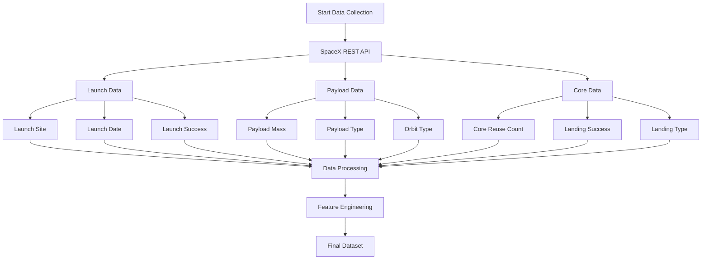

# SpaceX Data Collection Flow

## Key API Endpoints Used

1. **Launches API**
   - `GET /v4/launches`
   - `GET /v4/launches/{id}`
   - Key fields: launch_site, launch_date_utc, success

2. **Payloads API**
   - `GET /v4/payloads`
   - `GET /v4/payloads/{id}`
   - Key fields: mass_kg, type, orbit

3. **Cores API**
   - `GET /v4/cores`
   - `GET /v4/cores/{id}`
   - Key fields: reuse_count, landing_success, landing_type

## Data Collection Process

1. **API Authentication**
   - No authentication required for public endpoints
   - Rate limiting: 30 requests per minute

2. **Data Extraction**
   - Pagination handling for large datasets
   - Error handling and retry logic
   - Data validation and cleaning

3. **Data Transformation**
   - JSON to structured format
   - Date/time standardization
   - Missing value handling
   - Feature extraction

4. **Data Storage**
   - Structured storage in pandas DataFrame
   - CSV export for persistence
   - Version control for dataset changes 