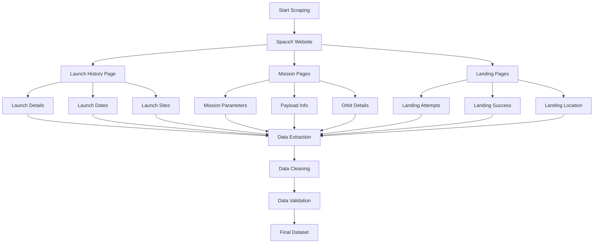

# SpaceX Web Scraping Process



## Web Scraping Components

1. **Target Pages**
   - Launch history pages
   - Individual mission pages
   - Landing attempt records
   - Weather data pages

2. **Scraping Tools**
   - BeautifulSoup for HTML parsing
   - Requests for HTTP calls
   - Selenium for dynamic content
   - Pandas for data storage

3. **Data Points Collected**
   - Launch dates and times
   - Mission parameters
   - Payload specifications
   - Landing outcomes
   - Weather conditions
   - Launch site details

## Scraping Process

1. **Page Navigation**
   - URL structure analysis
   - Pagination handling
   - Dynamic content loading
   - Error handling

2. **Data Extraction**
   - HTML parsing
   - Text extraction
   - Table scraping
   - Image data processing

3. **Data Processing**
   - Text cleaning
   - Date standardization
   - Unit conversion
   - Missing value handling

4. **Quality Control**
   - Data validation
   - Duplicate checking
   - Format verification
   - Consistency checks

## Implementation Example

```python
import requests
from bs4 import BeautifulSoup
import pandas as pd

def scrape_spacex_data():
    # Base URL for SpaceX launches
    base_url = "https://www.spacex.com/launches/"
    
    # Initialize data storage
    launches_data = []
    
    # Scrape launch pages
    for page in range(1, total_pages + 1):
        url = f"{base_url}?page={page}"
        response = requests.get(url)
        soup = BeautifulSoup(response.text, 'html.parser')
        
        # Extract launch data
        launches = soup.find_all('div', class_='launch-item')
        for launch in launches:
            launch_data = {
                'date': extract_date(launch),
                'mission': extract_mission(launch),
                'payload': extract_payload(launch),
                'outcome': extract_outcome(launch)
            }
            launches_data.append(launch_data)
    
    return pd.DataFrame(launches_data) 